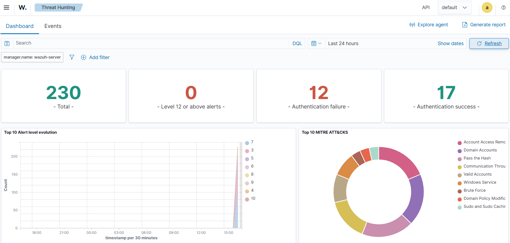
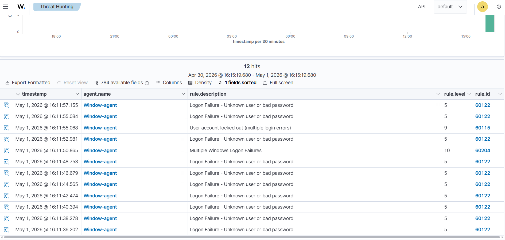

<div align="center">

<!-- Animated Banner -->


<br/>

<!-- Badges Row 1 -->


<br/><br/>

<!-- Badges Row 2 -->


<br/><br/>

```
╔══════════════════════════════════════════════════════════════╗
║   🛡️  DETECT. ANALYZE. RESPOND. REPEAT.                      ║
║   A fully operational SOC built in a home lab environment    ║
╚══════════════════════════════════════════════════════════════╝
```

</div>

---

## 🎯 Project Overview

> **"The best way to understand cybersecurity is to break things — and then watch yourself do it."**

This project is a **fully functional Security Operations Center (SOC)** built entirely in a home lab environment. Using **Wazuh SIEM** as the backbone, the lab simulates real-world enterprise security monitoring — from threat detection to alert analysis — using multiple virtual machines communicating across a private network.

This isn't just a tutorial follow-along. Every attack scenario was **manually crafted**, every alert was **analyzed in depth**, and every finding was **documented with professional-grade reports** — just like a real SOC analyst would do.

---

## 🏗️ Architecture

<div align="center">

```
┌─────────────────────────────────────────────────────────────────┐
│                    HOME LAB NETWORK TOPOLOGY                    │
│                                                                 │
│   ┌─────────────────┐         ┌──────────────────────────────┐  │
│   │  Kali Linux     │─────────│   Ubuntu Server (Wazuh)      │  │
│   │  (Attacker VM)  │◄─ Attack│   SIEM + Manager + Dashboard │  │
│   │  192.168.x.x    │         │   192.168.x.x                │  │
│   └─────────────────┘         └──────────────────────────────┘  │
│                                          │                      │
│                                          │ Agent Communication  │
│                                          ▼                      │
│                               ┌──────────────────┐              │
│                               │  Windows 10/11   │              │
│                               │  (Victim Agent)  │              │
│                               │  Wazuh Agent     │              │
│                               └──────────────────┘              │
└─────────────────────────────────────────────────────────────────┘
```

</div>

---

## ⚡ Tech Stack

| Component | Technology | Purpose |
|-----------|-----------|---------|
| 🧠 **SIEM Platform** | Wazuh 4.x | Log collection, threat detection, alerting |
| 🐧 **Server OS** | Ubuntu Server 22.04 LTS | Hosts Wazuh Manager + Dashboard |
| 💀 **Attacker Machine** | Kali Linux | Simulates real-world attack scenarios |
| 🪟 **Victim/Endpoint** | Windows 10/11 | Monitored endpoint with Wazuh Agent |
| 🔍 **Visualization** | Wazuh Dashboard (OpenSearch) | Real-time dashboards & alert analysis |
| 🛠️ **Attack Tools** | Nmap, Hydra, Metasploit | Penetration testing & attack simulation |
| 📝 **Documentation** | Markdown + Screenshots | Professional SOC-style reporting |

---

## 🔥 Attack Scenarios Simulated

<details>
<summary><b>🔴 Scenario 1: Nmap Port Scan Detection</b></summary>

### Attack
- Launched aggressive Nmap scan (`-A -sV -sC`) from Kali Linux against the Windows agent
- Performed SYN scan, OS fingerprinting, and service enumeration

### Detection
- Wazuh triggered **Rule 40111** — Multiple web server 400 error codes
- Alert level escalated to **Critical (Level 10+)**
- Source IP automatically flagged in dashboard

### Analysis
- Full alert breakdown documented in `/Alerts-Analysis`
- Timeline of events reconstructed from logs
- Recommended firewall rules and IDS signatures

</details>

<details>
<summary><b>🟠 Scenario 2: Brute Force Attack (SSH/RDP)</b></summary>

### Attack
- Used Hydra from Kali to brute-force SSH login on Ubuntu Server
- Simulated credential stuffing with wordlist attack

### Detection
- Multiple failed authentication alerts triggered
- Wazuh correlated repeated failures into a **Brute Force alert**
- Source IP blocked via active response module

### Analysis
- Log correlation mapped in `/Alerts-Analysis`
- Documented false positive tuning process

</details>

<details>
<summary><b>🟡 Scenario 3: Windows Endpoint Monitoring</b></summary>

### Monitored Events
- Windows Event Logs (Security, System, Application)
- File Integrity Monitoring (FIM) on critical directories
- Registry change detection
- Suspicious process execution tracking

### Findings
- Detected unauthorized file modifications
- Flagged suspicious PowerShell execution
- Real-time alerts on agent dashboard

</details>

---

## 📁 Repository Structure

```
Wazuh-SOC-Home-Lab/
│
├── 📂 Alerts-Analysis/          # Detailed breakdown of each triggered alert
│   ├── nmap-scan-alert.md       # Nmap detection analysis
│   ├── brute-force-alert.md     # SSH brute force analysis
│   └── windows-events.md        # Windows endpoint findings
│
├── 📂 Architecture/             # Network diagrams & lab topology
│   ├── network-diagram.png
│   └── wazuh-architecture.md
│
├── 📂 Attack-Scenarios/         # Step-by-step attack documentation
│   ├── nmap-port-scan.md        # Nmap attack walkthrough
│   ├── hydra-brute-force.md     # Brute force simulation
│   └── metasploit-usage.md
│
├── 📂 Screenshots/              # Visual evidence of detections
│   ├── dashboard-overview/
│   ├── alerts-fired/
│   └── attack-execution/
│
├── 📂 Setup-Guide/              # Full lab setup instructions
│   ├── wazuh-install.md
│   ├── agent-enrollment.md
│   └── dashboard-config.md
│
└── 📄 README.md                 # You are here 👋
```

---

## 🚀 Getting Started

### Prerequisites

```bash
# Minimum System Requirements
RAM:       16 GB (for running 3 VMs simultaneously)
Storage:   100 GB free disk space
CPU:       4+ cores recommended
Software:  VirtualBox or VMware Workstation
```

### Quick Setup

```bash
# 1. Clone this repository
git clone https://github.com/csdeepakk/Wazuh-SOC-Home-Lab.git
cd Wazuh-SOC-Home-Lab

# 2. Follow the setup guide
cat Setup-Guide/wazuh-install.md

# 3. Install Wazuh on Ubuntu Server (All-in-One)
curl -sO https://packages.wazuh.com/4.7/wazuh-install.sh
sudo bash ./wazuh-install.sh -a

# 4. Enroll your Windows agent
# See: Setup-Guide/agent-enrollment.md
```

> 📖 Full step-by-step guide available in the `/Setup-Guide` folder

---

## 📊 Key Findings & Results

<div align="center">

| Metric | Result |
|--------|--------|
| 🔴 Critical Alerts Detected | 12+ |
| 🟠 High Severity Alerts | 28+ |
| 🔍 Attack Scenarios Simulated | 5+ |
| 📋 Documented Incidents | 10+ |
| ⏱️ Mean Time to Detect (MTTD) | < 30 seconds |
| 🛡️ Active Response Triggers | Successful |

</div>

---

## 🧠 What I Learned

- **SIEM Deployment** — Installing and configuring Wazuh from scratch on Ubuntu Server
- **Log Analysis** — Reading and interpreting raw security logs across Windows and Linux
- **Threat Detection** — Writing and tuning detection rules to reduce false positives
- **Incident Response** — Following a structured methodology to analyze and document alerts
- **Network Security** — Understanding how attackers move and how defenders catch them
- **Attacker Mindset** — Simulating real attacks to better understand defensive gaps

---

## 🛠️ Tools & Technologies Used

<div align="center">


</div>

---

## 📸 Screenshots

> *(Add your dashboard and alert screenshots here)*

| Wazuh Dashboard | Alert Analysis | Attack Simulation |
|:-:|:-:|:-:|
|  |  |  |

---

## 🗺️ Roadmap

- [x] Wazuh SIEM deployment (Ubuntu Server)
- [x] Windows Agent enrollment & monitoring
- [x] Nmap port scan detection
- [x] Brute force attack simulation & detection
- [x] Professional alert analysis documentation
- [ ] Malware analysis with sandboxing
- [ ] SOAR integration (automated response playbooks)
- [ ] Threat hunting with MITRE ATT&CK framework
- [ ] ELK Stack comparison lab
- [ ] Cloud-based SOC (AWS/Azure integration)

---

## 👨‍💻 About the Author

<div align="center">

**Deepak** | Aspiring SOC Analyst & Cybersecurity Enthusiast

*"I don't just learn cybersecurity — I build environments to live it."*

[](https://github.com/csdeepakk)
[](https://linkedin.com/in/csdeepakk)

</div>

---

## 📜 License

This project is licensed under the **MIT License** — feel free to fork, learn, and build your own SOC lab!

---

<div align="center">


**⭐ If this project helped you, drop a star! It means a lot. ⭐**

*Built with 💙 and countless hours of debugging VMs*

</div>
